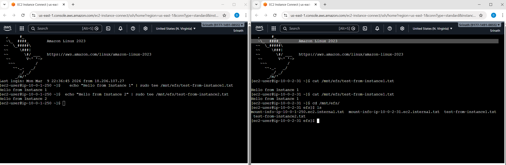

# AWS EFS Lab - Complete Learning Package



This repository contains everything you need to learn AWS EFS (Elastic File System) - from automated scripts to detailed manual guides.

## 🎯 What You'll Learn

- Create VPC with multi-AZ subnets
- Configure security groups for EC2 and EFS
- Set up EFS file system with mount targets
- Launch EC2 instances with auto-mount configuration
- Verify shared storage across multiple instances
- Understand high availability architecture

## 📚 Documentation Guide

| Document | Purpose | Time | Best For |
|----------|---------|------|----------|
| **HOW-TO-RUN.md** | Start here - choose your method | 2 min read | Everyone |
| **MANUAL-CONSOLE-SETUP.md** | Complete manual setup (21 steps) | 30-40 min | Learning AWS Console |
| **TESTING-GUIDE.md** | Verify EFS shared storage | 10 min | Testing & verification |
| **QUICK-REFERENCE.md** | Command cheat sheet | Quick lookup | Quick reference |
| **ARCHITECTURE-EXPLAINED.md** | Deep dive into architecture | 15 min read | Understanding design |
| **README.md** | This file - overview | 5 min read | Getting started |

## 🚀 Quick Start (3 Methods)

### Method 1: One-Command Complete (Easiest)
```bash
git clone https://github.com/SrinathMLOps/efs.git
cd efs
chmod +x run-complete-lab.sh
./run-complete-lab.sh
```
Fully automated: checks region → cleans up → sets up → verifies

### Method 2: Step-by-Step Automated
```bash
git clone https://github.com/SrinathMLOps/efs.git
cd efs
chmod +x *.sh
./check-current-region.sh           # Check region
./verify-and-cleanup-all.sh         # Clean + verify
./aws-efs-lab-setup-v2.sh           # Setup
./verify-setup.sh                    # Verify ready
```

### Method 3: Manual Console
See **MANUAL-CONSOLE-SETUP.md** for complete 21-step guide

**👉 See HOW-TO-RUN.md for detailed instructions**

## 📦 Repository Contents

### 🤖 Automation Scripts
- `run-complete-lab.sh` - **ONE-COMMAND COMPLETE WORKFLOW** (use this for easiest setup)
- `aws-efs-lab-setup-v2.sh` - Main setup script (improved version)
- `aws-efs-lab-setup.sh` - Legacy version
- `verify-and-cleanup-all.sh` - **Check region + cleanup + verify** (interactive)
- `cleanup-all-efs-resources.sh` - Delete all EFS lab resources (direct)
- `cleanup-efs-lab.sh` - Generated after setup for specific cleanup
- `check-current-region.sh` - Detect and display current AWS region
- `verify-setup.sh` - Check if resources are ready
- `connect-instances.sh` - Interactive connection helper
- `test-efs-from-instance.sh` - Run on EC2 to test EFS

### 📖 Documentation
- `HOW-TO-RUN.md` - **Start here** - Complete running guide
- `MANUAL-CONSOLE-SETUP.md` - **21-step manual guide**
- `TESTING-GUIDE.md` - Testing and verification procedures
- `QUICK-REFERENCE.md` - Command cheat sheet
- `ARCHITECTURE-EXPLAINED.md` - Architecture deep dive
- `README.md` - This overview file

### 🖼️ Diagrams
- `efs.png` - Architecture diagram (see ARCHITECTURE-EXPLAINED.md)

## Prerequisites

1. AWS CLI installed and configured
2. AWS credentials with appropriate permissions
3. Bash shell (Linux/Mac/WSL)

## Quick Start

### In AWS CloudShell:

**STEP 1: Clone the repository**
```bash
git clone https://github.com/SrinathMLOps/efs.git
cd efs
```

**STEP 2: Make scripts executable**
```bash
chmod +x *.sh
```

**STEP 3: Cleanup any existing resources**
```bash
./cleanup-all-efs-resources.sh
```

**STEP 4: Run the setup (takes 4-5 minutes)**
```bash
./aws-efs-lab-setup-v2.sh
```

**STEP 5: Verify setup is complete**
```bash
./verify-setup.sh
```

**STEP 6: View connection details**
```bash
cat lab-summary.txt
```

**STEP 7: Connect and test**
- Use EC2 Instance Connect (browser) - easiest
- Or SSH: `ssh -i efs-lab-key.pem ec2-user@<INSTANCE_IP>`

**STEP 8: When done, cleanup**
```bash
./cleanup-efs-lab.sh
```

## Available Scripts

- `cleanup-all-efs-resources.sh` - Delete ALL existing EFS lab resources (run first)
- `aws-efs-lab-setup-v2.sh` - Main setup script (improved version)
- `aws-efs-lab-setup.sh` - Original setup script (legacy)
- `verify-setup.sh` - Check if resources are ready
- `connect-instances.sh` - Interactive connection helper
- `cleanup-efs-lab.sh` - Generated after setup to cleanup specific resources

## What This Script Does

1. Creates VPC (10.0.0.0/16) with DNS hostnames enabled
2. Creates 2 subnets in different AZs (us-east-1a, us-east-1b)
3. Sets up Internet Gateway and routing
4. Creates security groups:
   - EC2 SG: Allows SSH from your IP + EC2 Instance Connect
   - EFS SG: Allows NFS (port 2049) from EC2 instances
5. Generates SSH key pair
6. Creates EFS file system with mount targets in both AZs
7. Launches 2 EC2 instances with auto-mount configuration
8. Waits for instances to pass status checks (ready for SSH)
9. Provides connection details and testing instructions

**Key improvements**:
- Adds EC2 Instance Connect IP range to security group
- Waits for status checks to pass before completing
- Enhanced user data script with logging and retry logic
- Verification script to check setup status

## Testing EFS Shared Storage

The script waits for instances to be fully ready. After completion:

### Method 1: EC2 Instance Connect (Browser - Easiest)
1. Go to EC2 Console
2. Select "EFS-Lab-Instance-1"
3. Click **"Connect"** button
4. Choose **"EC2 Instance Connect"**
5. Click **"Connect"** (opens in browser)

### Method 2: SSH from Terminal
```bash
ssh -i efs-lab-key.pem ec2-user@<INSTANCE1_IP>
```

### Method 3: Use Helper Script
```bash
./connect-instances.sh
```

### Verify EFS Mount
```bash
# Check if EFS is mounted
df -h | grep efs

# List files
ls -la /mnt/efs/

# Check user data logs if issues
sudo cat /var/log/user-data.log
```

### Connect to Instance 1
```bash
ssh -i efs-lab-key.pem ec2-user@<INSTANCE1_IP>
```

### Create test file
```bash
echo "Hello from Instance 1" | sudo tee /mnt/efs/test1.txt
ls -l /mnt/efs/
```

### Connect to Instance 2
```bash
ssh -i efs-lab-key.pem ec2-user@<INSTANCE2_IP>
```

### Verify shared storage
```bash
cat /mnt/efs/test1.txt  # Should show "Hello from Instance 1"
echo "Hello from Instance 2" | sudo tee /mnt/efs/test2.txt
```

### Back to Instance 1
```bash
cat /mnt/efs/test2.txt  # Should show "Hello from Instance 2"
```

## Cleanup

To delete all resources and avoid charges:

```bash
./cleanup-efs-lab.sh
```

## Architecture

```
VPC (10.0.0.0/16)
├── Subnet 1 (us-east-1a)
│   ├── EC2 Instance 1
│   └── EFS Mount Target 1
├── Subnet 2 (us-east-1b)
│   ├── EC2 Instance 2
│   └── EFS Mount Target 2
└── EFS File System (shared storage)
```

## Key Concepts Demonstrated

- VPC networking and subnets
- Multi-AZ deployment for high availability
- Security group configuration (SSH and NFS)
- EFS mount targets and NFS protocol
- Shared storage across multiple EC2 instances
- Persistent mounting via /etc/fstab

## Troubleshooting

### "Failed to connect to your instance" Error

**Cause**: Instance still initializing or security group issue

**Solution**:
```bash
# Check if instances are ready
./verify-setup.sh

# If status checks not passed, wait 2 more minutes
```

### EFS Not Mounted

**Check mount status**:
```bash
df -h | grep efs
mountpoint /mnt/efs
```

**Manual mount**:
```bash
sudo mount -t efs <EFS_ID>:/ /mnt/efs
```

**Check logs**:
```bash
sudo cat /var/log/user-data.log
```

### Cannot SSH with Key

**Fix permissions**:
```bash
chmod 400 efs-lab-key.pem
```

**Verify key**:
```bash
ssh-keygen -l -f efs-lab-key.pem
```

## Cost Estimate

- 2 x t2.micro EC2: ~$0.02/hour
- EFS storage: ~$0.30/GB/month
- Data transfer: Minimal for testing

Remember to run cleanup script after testing!
